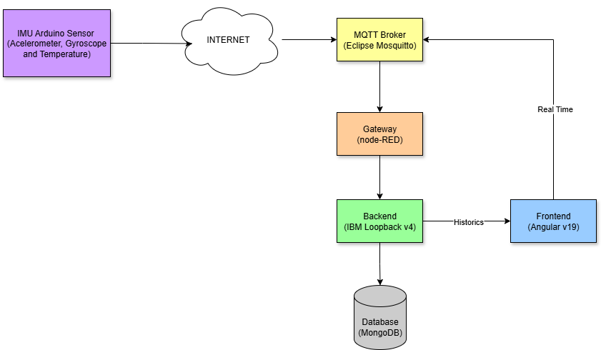
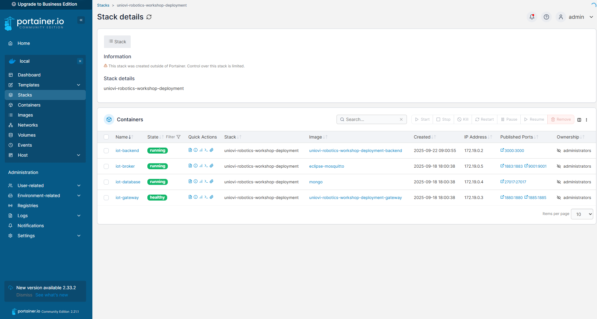
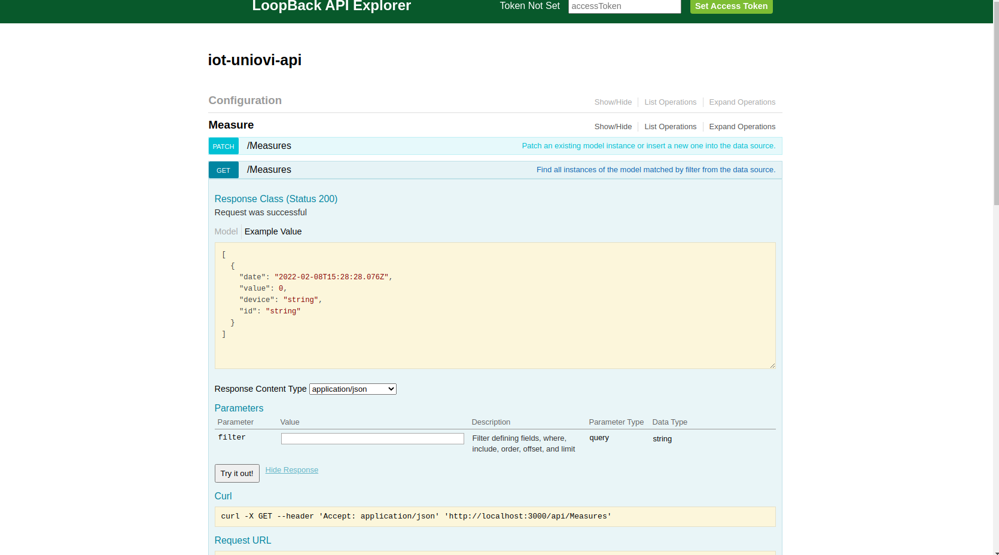
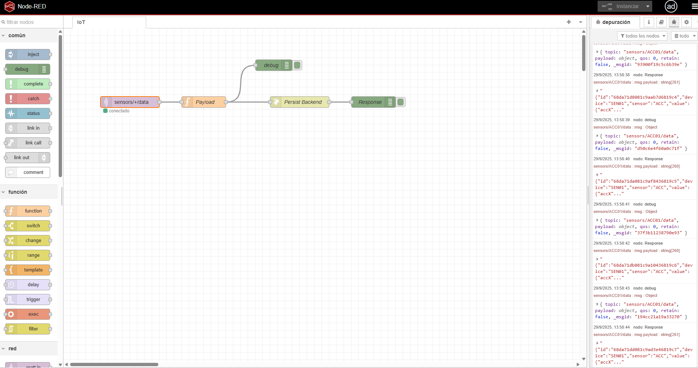

# Description
IoT Deployment Uniovi Robotics Workshop 

## IoT Architecture


## Deploy docker stack service and compile
Deploy docker stack on development
```
$ docker compose -f docker-compose.dev.yaml up -d --build
```

Deploy docker stack on production
```shell
$ docker compose up -d --build
```

## Stop docker stack
```shell
$ docker-compose stop
```

## Restart docker stack
```shell
$ docker-compose start
```

## Remove docker stack
```shell
$ docker-compose down
```

remove volumes too
```shell
$ docker-compose down -v
```

## Get all docker stack service logs
```shell
$ docker-compose logs
```

## Some IoT UIs

- **Uniovi network** from [portainer](https://localhost:9443) we could check the uniovi network



- **API Explorer** from [Loopback Explorer](http://localhost:3000/explorer) we could check the backend API



- **node-RED Designer** from [node-RED Designer](http://localhost:1880) we could check the iot flows:



- **Frontend Dashboard** from [IoT Dashboard](http://localhost:4200) we could check the iot sensors graphs:
 
