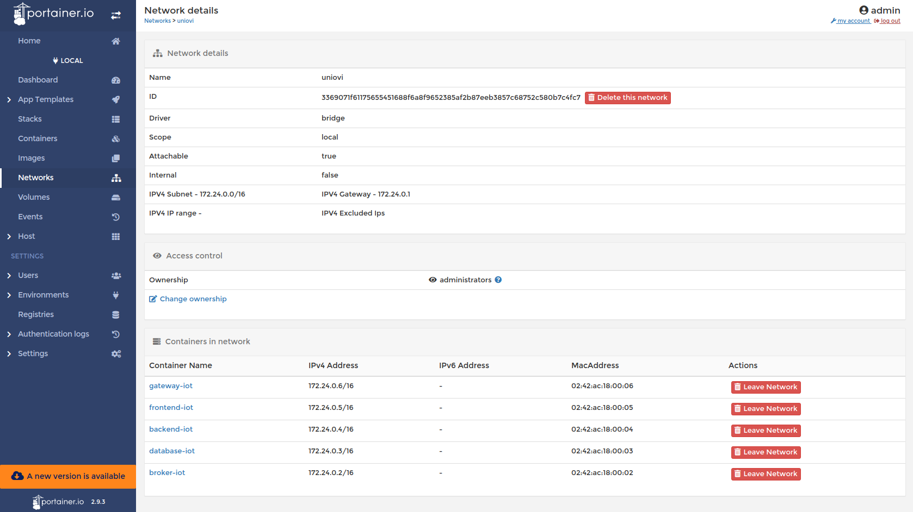
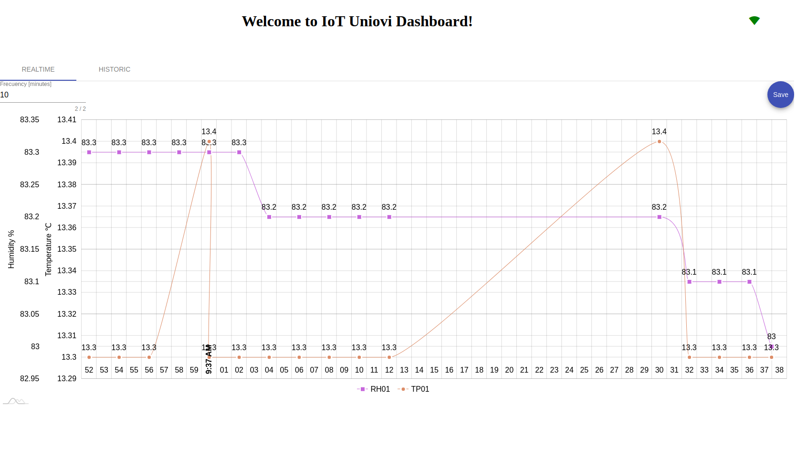
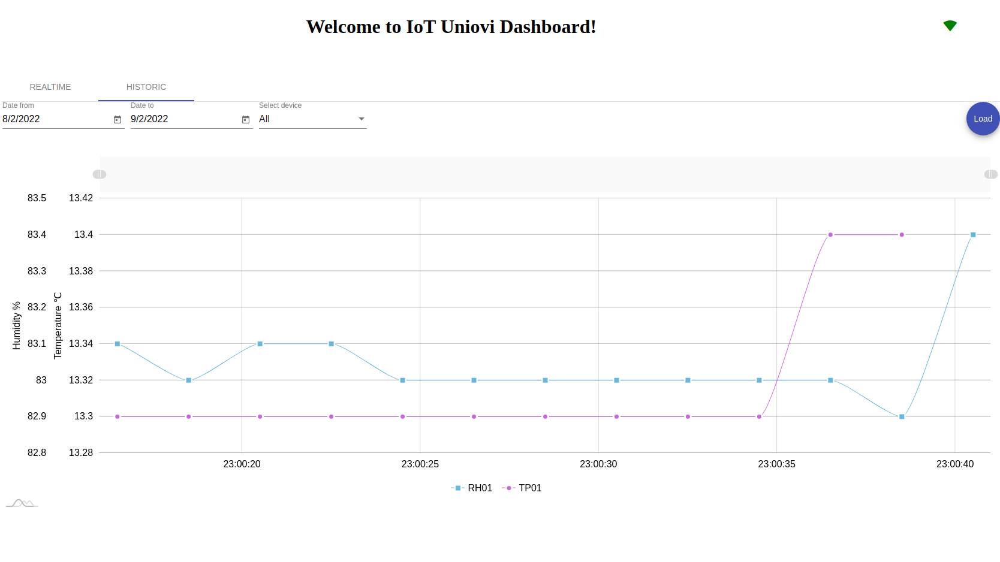

# Description
IoT Deployment Uniovi Robotics Workshop 

## IoT Architecture


## Deploy all stack services and compile
In powershell
```
$env:NODE_ENV="development"; npm run start
```

```shell
NODE_ENV=development docker compose up --build
```

## Stop stack service
```shell
docker-compose stop
```

## Restart stack service
```shell
docker-compose start
```

## Remove stack service resources
```shell
docker-compose down
```

remove volumes too
```shell
docker-compose down -v
```

## Get service logs
```shell
docker-compose logs
```

## Some IoT UIs

- **Uniovi network** from [portainer](https://localhost:9443) we could check the uniovi network



- **API Explorer** from [Loopback Explorer](http://localhost:3000/explorer) we could check the backend API


- **node-RED Designer** from [node-RED Designer](http://localhost:1880) we could check the iot flows:


- **node-RED Dashboard** from [IoT Dashboard](http://localhost:4200) we could check the iot sensors graphs:
 


- **node-RED Dashboard** from [IoT Dashboard](http://localhost:4200) we could check the iot sensors historic:
 
