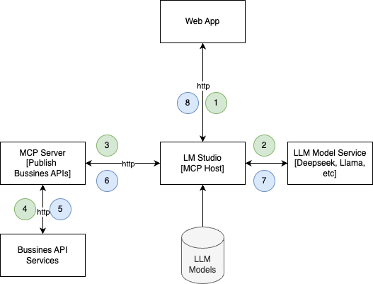

# Description
IoT Deployment Uniovi Robotics Workshop 

## IoT Architecture


## Deploy docker stack service and compile
Deploy docker stack on development
```
$ docker compose -f docker-compose.dev.yaml up -d
```

Deploy docker stack on production
```shell
$ docker compose up -d --build
```

## Stop docker stack
```shell
$ docker-compose stop
```

## Restart docker stack
```shell
$ docker-compose start
```

## Remove docker stack
```shell
$ docker-compose down
```

remove volumes too
```shell
$ docker-compose down -v
```

## Get all docker stack service logs
```shell
$ docker-compose logs
```

## Publish mqtt port
In windows in case not use docker Desktop and install Docker inside WSL2 directly your services can not be access externally to your computer so you must publish them using tools like ngrok. Create an account in ngrok and create a new AUTH_TOKEN from your account:

```shell
docker run --name iot-proxy --net=host -it --rm -e NGROK_AUTHTOKEN=<AUTH_TOKEN> ngrok/ngrok:latest tcp 1883
```

## Some IoT UIs

- **Uniovi network** from [portainer](https://localhost:9443) we could check the uniovi network


- **API Explorer** from [Loopback Explorer](http://localhost:3000/explorer) we could check the backend API


- **node-RED Designer** from [node-RED Designer](http://localhost:1880) we could check the iot flows:


- **Frontend Dashboard** from [IoT Dashboard](http://localhost:4200) we could check the iot sensors graphs:
 


## Some links

- [Mosquitto clients](https://mosquitto.org/download/)

## Some commands:

To test your broker publish some mock data execute this command:

First subscribe to a topic called sensors/T01/data
```
mosquitto_sub -d -h localhost -p 1883 -u admin -P password -t sensors/T01/data
```

Second publish a mock measure to the same topic sensors/T01/data
```
mosquitto_pub -d -h localhost -p 1883 -u admin -P password -t sensors/T01/data -m '{"accX": 23.5, "accY": 9.3, "accZ": 10.1}'
```

## IoT Future

One IoT Future Architecture coulb be integrate IA in our Architecture to recover information from our IoT Dataset or send commands to our microcontrolles using:

- Implement NLP (Natural Language Processing) using LLM (Large Language models) models like: [Llama](https://www.llama.com/), [Deepseek](https://www.deepseek.com/).

- Use Protocols like [MCP (Model Context Protocol)](https://modelcontextprotocol.io/docs/getting-started/intro) to implement RAG (Retrieval Augmented Generation) to integrate our LLM models with our business services.

- Use LLM tools like [LM Studio](https://lmstudio.ai/) to:
    - Manage and control our LLM models easy and visually.
    - Host our MCP Servers to implement RAG
    - Offer an API to send prompts to our LLM models

An IoT IA Architeture could be:

