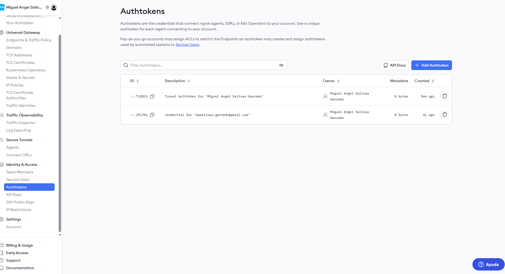

# Execute mosquitto with some configurations:
This mosquitto data:

# Configure mosquitto
Securize mosquitto. Login into the container and create a new password
```
$ docker exec -it iot-broker sh
```

Inside, create a admin user with password password, executing this command.
```
$ mosquitto_passwd -c mosquitto.passwd admin
```

This will create a password file called mosquitto.passwd we can edit or download to be used in docker compose
```
$ docker cp iot-broker:/mosquitto.passwd ./
```

# MQTT Client
Install the MQTT Clients in ubuntu to make tests and debug
```
$ sudo apt-get install mosquitto mosquitto-clients
```

Subscribe to broker to T01 topic
```
$ mosquitto_sub -d -h localhost -p 1883 -u admin -P password -t T01
```

Publish to broker to T01 topic
```
$ mosquitto_pub -d -h localhost -p 1883 -u admin -P password -t sensors/T01/data -m '{"accX": 23.5, "accY": 9.3, "accZ": 10.1}''

```

## Notes

- If you installed docker inside Windows WSL2 and not used the Docker Desktop you must publish the MQTT Server port 1883. We can use the tool ngrok:
    - We are use the tool [ngrok](https://ngrok.com "ngrok") to publish our port using [ngrok docker](https://ngrok.com/download/docker "ngrok docker")
    - Create an account token to publish your ports
    - Execute this command to publish your mqtt port 1883:

        ```
        docker run --name iot-proxy --net=host -it --rm -e NGROK_AUTHTOKEN=<YOUR_TOKEN> ngrok/ngrok:latest tcp 1883
        ngrok                                                                                                       (Ctrl+C to quit)                                                                                                                            🧠 Call internal services from your gateway: https://ngrok.com/r/http-request                                                                                                                                                                           Session Status                online                                                                                        Account                       Miguel Angel Salinas Gancedo (Plan: Free)                                                     Update                        update available (version 3.30.0, Ctrl-U to update)                                           Version                       3.30.0                                                                                        Region                        Europe (eu)                                                                                   Latency                       42ms                                                                                          Web Interface                 http://0.0.0.0:4040                                                                           Forwarding                    tcp://4.tcp.eu.ngrok.io:12596 -> localhost:1880                                                                                                                                                                           Connections                   ttl     opn     rt1     rt5     p50     p90                                                                                 0       0       0.00    0.00    0.00    0.00
        ```

        

# Some links
- [MQTT Client](https://www.luisllamas.es/en/how-to-install-mosquitto-the-mqtt-broker/)